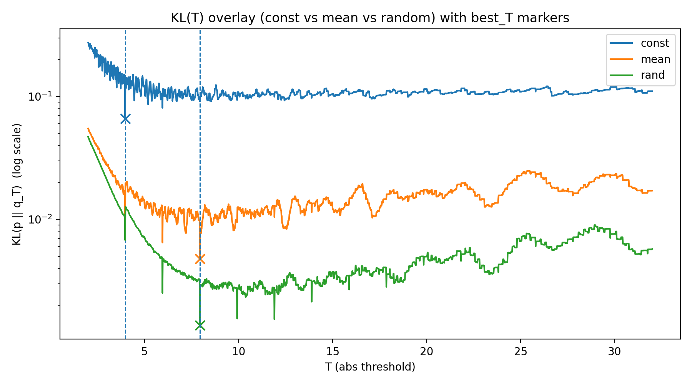

# YOLOv11m Hybrid Inference on Jetson Orin NX (DLA INT8 + GPU FP16)

> 문서 목적: **DLA 제약 하에서 하이브리드 분할 실행을 구현**하고, 핵심 리스크인 **PTQ 정확도 붕괴를 padding 기반 calibration 설계로 회복**한 과정과 근거를 정리한다. 추가로 동일 프로토콜로 **정확도·성능·전력/에너지**를 측정해 하이브리드 운용 trade-off를 제시한다.  
> ⚠️ 본 문서는 **현재 확보된 결과/근거로만** 작성하며, **추가 실험은 후속 과제**로 남긴다.

<br>

## 0. Executive Summary

### 0.1 요약 (One-page)

본 프로젝트는 Jetson Orin NX 16GB에서 YOLOv11m을 **DLA(INT8 PTQ) + GPU(FP16)**로 분할 실행하고, PTQ 과정에서 발생한 **mAP 급락(정확도 붕괴)**을 **calibration 입력의 letterbox padding 분포 설계(calibration-only)**로 복구한 엔지니어링 기록이다. 또한 동일 프로토콜로 **정확도·성능(FPS/latency)·전력/에너지**를 측정하여, 하이브리드 운용 trade-off를 수치로 정리했다.

#### 핵심 성과(3)

1. **Hybrid Split Execution 구현**  
   DLA에서 backbone + per-scale branch를 최대한 처리하고, 이후 모듈(C2PSA 및 head)을 GPU로 넘기는 방식으로 **이종 가속기 분할 실행**을 구현했다.

2. **PTQ 붕괴 복구(원인 분리 포함)**  
   PTQ mAP 급락의 지배 요인이 샘플링 자체보다 **letterbox padding이 유발하는 histogram spike**임을 분리해 관측하고, **calibration-only mean padding / random padding**으로 mAP를 안정적으로 회복했다.

3. **Trade-off 정량화**  
   GPU-only 대비 **최대 throughput +50% 이상**, **프레임당(Idle-subtracted) 에너지 -30% 내외** 개선을 확인했으며, latency는 일정 수준 증가했다(모드/스케줄에 따라 상이).

> NOTE: 전력/에너지는 모두 Idle-subtracted(`P_excess`) 기준이며, FPS/latency는 warmup/skip 제외 후 동일 프로토콜(Section 7)로 집계했다.

<br>

### 0.2 결과 요약

#### (A) Accuracy (Track A)

- YOLO11s GPU FP16: **mAP50-95 = 44.92**
- YOLO11m GPU FP16: **mAP50-95 = 49.52**
- YOLO11m Hybrid INT8+FP16 (1K calibration, padding sweep)
  - random padding (seed 42/84/126): **48.15 / 48.10 / 48.71**
  - mean padding (seed 42/84/126): **48.44 / 48.12 / 48.62**
  - const padding(참조) (seed 42/84/126): **42.70 / 42.45 / 43.23**

> 요약: const 대비 mean/random은 평균 **+5.6p / +5.53p** mAP 회복(1K PTQ). FP16 대비 손실은 **-0.8 ~ -1.4p** 범위로 제한됨(Section 5.1.1).

#### (B) 성능/전력/에너지 (요약)

- throughput(캡 해제): **FPS +52.9%**, **E_frame -33% 내외**
- latency 모드: **p50 latency +15% 내외**, 대신 **전력/에너지 감소** 확인
- (참고) cap=30/45 실험은 **동일 목표 FPS에서의 전력/프레임 에너지 비교**를 위해 포함

<br>

### 0.3 Glossary (용어/정의)

- **const padding(114)**: 운영 전처리에서 사용하는 기본 letterbox padding 값(고정 단색).
- **mean padding**: *이미지별* 입력 이미지의 RGB 평균 단색을 padding 영역 전체에 적용.
- **random padding (이미지별 단색)**  
  - 정의: *이미지마다* padding 영역 전체에 적용할 RGB 단색(solid color)을 난수로 샘플링  
  - 분포: 채널별 `N(μ_c, 2σ_c)` (train-set 통계 기반)에서 샘플링 후 `[0,255]` clip  
  - 목적: 고정 단색(const)의 반복이 만드는 histogram **bin-mass spike/comb**를 약화시키기 위한 **입력 분포 분산**  
  - ⚠️ 주: 운영/추론 전처리는 `const(114)` 유지(=calibration-only 적용)  
  - 의도(원인 분리): mean padding의 효과가 “mean 값 자체”인지 “값 분산(흩어짐)”인지 분리하기 위한 ablation  
  - 구현: 채널별 독립 샘플링(픽셀별 랜덤 아님) → 이미지별 RGB 단색 생성 → padding 영역 전체에 적용

- **Track A/B**
  - Track A = mAP 평가(PR 보존)용 (`conf=0.001, iou=0.45, max_det=1000`)
  - Track B = 운영/벤치(FPS·전력·latency 우선)용 (`conf=0.25, iou=0.45, max_det=300`)

- **P_excess / E_frame**
  - `P_excess = P_avg - P_idle` (Idle baseline 제거)
  - `E_frame(J) = P_excess(W) / FPS`

- **Latency 지표 정의**
  - 본 문서의 latency는 벤치 로그의 end-to-end(e2e) 시간 분포를 기준으로 p50/p95/p99를 함께 보고한다.
  - throughput+fps_cap 구성에서는 페이싱(sleep)이 e2e에 포함될 수 있어 **latency 비교 지표에서 제외**하고, 해당 케이스는 FPS/전력/에너지 비교 목적으로만 사용한다.

<br>

### 0.4 설계 원칙

- **분할 경계**: P3/P4/P5 각 경로에서 **C3k2 이후**를 경계로 분할
  - C2PSA는 DLA 미지원(MatMul 계열) → op 변경 없이 DLA-part 비율을 최대화하기 위해 C3k2 직후를 경계로 선택
- **PTQ 정책**: calibration 단계에서 padding 값 분포를 분산(mean/random)시켜 spike/comb 완화 → step 추정 안정화 → mAP 급락 방지
- ⚠️ **운영 적용 시 주의**: 본 결론은 운영 전처리를 변경하라는 의미가 아니라, **PTQ calibration 입력 생성 단계에서만** padding 정책을 조정하는 접근이다.

<br>

### 0.5 구현 목록 및 대표 벤치 결과

#### 0.5.1 구현 목록

- **이름 기반 바인딩 매핑**: TRT binding index 변동 리스크를 피하기 위해 **tensor name 기반**으로 DLA outputs ↔ GPU inputs 매핑 검증
- **DLA→GPU device memory direct-connect**: DLA 출력 버퍼를 **GPU에서 접근 가능한 device memory**로 유지하여 D2H/H2D 없이 연결
- **이벤트 동기화 체인**: `cudaEventRecord(evDLA_done)` 후 `cudaStreamWaitEvent(streamGPU, evDLA_done)`로 **필요 구간만 동기화**
- **Ring-buffer 파이프라이닝(NBUF=3)**: throughput 모드에서 H2D/DLA/GPU/D2H를 슬롯 단위로 오버랩
- **측정 파이프라인**: FPS/latency(p50/p95/p99) + 전력/에너지(Idle-subtracted) 지표를 동일 프로토콜로 수집/정리

> NOTE: cap=30/45 조건에서도 **latency 모드**는 sleep 페이싱이 없으므로 latency 비교에 포함한다. throughput+cap만 제외한다.

#### 0.5.2 (A) FPS 30 cap (Baseline = GPU-only @ 30FPS)

| Mode | Engine | FPS | Lat p50 (ms) | Δ vs GPU | Lat p99 (ms) | Lat p99 Δ vs GPU | P_excess (W) | P_excess Δ vs GPU | E_frame (J) | E_excess Δ vs GPU |
|---|---|---:|---:|---:|---:|---:|---:|---:|---:|---:|
| GPU-only (baseline) | YOLO11m FP16 | 30.0039 | 15.0999 | 0.0% | 16.5699 | 0.0% | 6.686918 | 0.0% | 0.222868 | 0.0% |
| Hybrid (latency) | YOLO11m INT8(DLA)+FP16(GPU) | 30.0033 | 17.4769 | +15.7% | 18.1044 | +9.3% | 4.770185 | -28.7% | 0.158988 | -28.7% |
| Hybrid (throughput, cap=30)\* | YOLO11m INT8(DLA)+FP16(GPU) | 30.0000 | - | - | - | - | 4.454289 | -33.4% | 0.148476 | -33.4% |

\* throughput+cap: e2e에 페이싱(sleep) 포함 → latency 비교에서 제외

#### 0.5.3 (B) FPS 45 cap (Baseline = GPU-only @ 45FPS)

| Mode | Engine | FPS | Lat p50 (ms) | Δ vs GPU | Lat p99 (ms) | Lat p99 Δ vs GPU | P_excess (W) | P_excess Δ vs GPU | E_frame (J) | E_excess Δ vs GPU |
|---|---|---:|---:|---:|---:|---:|---:|---:|---:|---:|
| GPU-only (baseline) | YOLO11m FP16 | 45.0037 | 15.1155 | 0.0% | 16.6434 | 0.0% | 10.016536 | 0.0% | 0.222571 | 0.0% |
| Hybrid (latency) | YOLO11m INT8(DLA)+FP16(GPU) | 45.0022 | 17.4960 | +15.7% | 18.1154 | +8.9% | 7.119710 | -28.9% | 0.158208 | -28.9% |
| Hybrid (throughput, cap=45)\* | YOLO11m INT8(DLA)+FP16(GPU) | 45.0000 | - | - | - | - | 6.593644 | -34.2% | 0.146525 | -34.2% |

\* throughput+cap: latency 비교에서 제외

#### 0.5.4 (C) FPS cap 해제 / 최대 throughput (Baseline = GPU-only throughput)

| Mode | Engine | FPS | FPS Δ vs GPU | Lat p50 (ms) | Δ vs GPU | Lat p99 (ms) | Lat p99 Δ vs GPU | P_excess (W) | P_excess Δ vs GPU | E_frame (J) | E_excess Δ vs GPU |
|---|---|---:|---:|---:|---:|---:|---:|---:|---:|---:|---:|
| GPU-only (baseline) | YOLO11m FP16 | 60.0156 | 0.0% | 14.6912 | 0.0% | 16.6173 | 0.0% | 12.581801 | 0.0% | 0.209481 | 0.0% |
| Hybrid (throughput) | YOLO11m INT8(DLA)+FP16(GPU) | 91.7627 | +52.9% | 18.4095 | +25.3% | 19.5874 | +17.9% | 12.793363 | +1.7% | 0.139418 | -33.4% |

**계산 방법**
- `Δ vs GPU(%) = (값 / baseline - 1) × 100`

<br>

## 1. Project Scope

### 1.1 범위(In scope)

- Device: Jetson Orin NX 16GB
- Model: YOLOv11m (COCO pretrained)
- Hybrid: DLA(INT8, PTQ) + GPU(FP16)
- Accuracy metric: COCO val2017 mAP50-95
- Bench: 자체 벤치 도구로 FPS, latency(p50/p95/p99), power/energy 측정

### 1.2 범위 외(Out of scope)

- 학습 중심 최적화(QAT/재학습으로 SOTA 달성)
- 모델 전체를 단일 가속기에서 100% 실행
- 모든 플랫폼/모델로의 일반화

<br>

## 2. System Overview: Hybrid Split Execution

### 2.1 End-to-end pipeline

```text
Input Image
   |
   v
[Preprocess]
- resize/letterbox, normalize, layout convert
   |
   v
+--------------------------------------------------+
|   DLA segment (INT8, PTQ)                        |
|  - Backbone (shared trunk)                       |
|  - Per-scale branches up to C3k2                 |
|      P3 -> C3k2 -> (cut after C3k2)              |
|      P4 -> C3k2 -> (cut after C3k2)              |
|      P5 -> C3k2 -> (cut after C3k2)              |
+--------------------------------------------------+
   |            |             |
   | P3 feat    | P4 feat     | P5 feat
   v            v             v
+--------------------------------------------------+
|   GPU segment (FP16)                             |
|  - Modules after the split                       |
|  - Includes C2PSA and downstream dependent layers|
|  - Detect head / post-feature fusion             |
+--------------------------------------------------+
   |
   v
[Postprocess]
- decode, NMS, format conversion
   |
   v
Detections
```
<br>

### 2.2 Split 경계 설정 이유

* YOLOv11m의 C2PSA 모듈은 DLA 미지원(MatMul 연산)
* DLA 커버리지를 최대화하기 위해 P3/P4/P5 경로에서 **C3k2까지 DLA**, 이후 GPU로 분할
* 그래프 구조상 C2PSA 출력이 downstream 레이어 입력으로 광범위하게 전파 → C2PSA 이후 DLA 확장은 구조적으로 제한

### 2.3 Split I/O 명세 (DLA→GPU 인터페이스)

> 목적: 하이브리드 실행에서 모델을 어떻게 나누어 어떻게 그 사이를 연결했는지 기록
> 아래에는 본 프로젝트에서 사용하는 **경계 텐서 명세 + 바인딩 규칙 + 동기화 규칙**을 서술한다.
> ⚠️ 텐서 이름/채널 수는 **엔진 빌드 시점(ONNX graph)과 TRT binding name**에 종속되므로, 실제 값은 `trtexec --dumpBindings` 또는 bench 로그의 binding dump로 확정해야 한다.

#### 2.3.1 Split 경계 텐서

* **DLA(INT8) 엔진 출력**: 3개 피처맵

  * `P3_cut`: stride=8  (512×80×80 @ 640)
  * `P4_cut`: stride=16 (512×40×40 @ 640)
  * `P5_cut`: stride=32 (512×20×20 @ 640)
* **GPU(FP16) 엔진 입력**: 위 3개 피처맵을 그대로 입력으로 받음

  * `P3_in`, `P4_in`, `P5_in`

> NOTE: “C3k2 이후” 컷이므로, 이 텐서들은 **C3k2 출력**(각 scale branch output)이다.

#### 2.3.2 Tensor Shape / Dtype / Layout 규칙

**(A) Shape 규칙**

* 입력 이미지 `imgsz=640`, batch=1 기준
* 각 피처는 **NCHW**로 고정

| Tensor         | Stride | Spatial (C×H×W) | Layout |
| -------------- | -----: | --------------: | ------ |
| P3_cut / P3_in |      8 |       512×80×80 | NCHW   |
| P4_cut / P4_in |     16 |       512×40×40 | NCHW   |
| P5_cut / P5_in |     32 |       512×20×20 | NCHW   |

**(B) Dtype 규칙**

* DLA 엔진 출력 dtype

  * 기본: **FP16**
  * 이유: DLA INT8 내부 실행이어도, **경계 텐서를 FP16으로 export**하면 GPU 입력 바인딩과 호환이 단순해진다.
  * 대안: INT8 출력도 가능하나, 이 경우 GPU 엔진이 INT8 입력을 받아야 하고, 경계 변환/스케일 관리가 복잡해져 본 문서 범위 밖
* GPU 엔진 입력 dtype: **FP16** 고정

**(C) Layout 규칙**

* 경계 텐서 layout은 항상 **NCHW**

#### 2.3.3 Binding Name / Binding Order 확정 규칙

TRT 엔진은 binding이 “이름+순서”를 가진다. 본 프로젝트에서는 **순서(index)가 아닌 이름(name)**을 이용한다.

1. DLA 출력 binding name 3개를 확정한다.
2. GPU 입력 binding name 3개를 확정한다.
3. bench 실행 시, `DLA_output[i] -> GPU_input[j]` 매핑을 **이름 기반으로 검증**한다.

   * 순서(index) 기반 매핑은 엔진 rebuild 시 깨질 수 있으므로, “이름”을 사용한다.

> NOTE: binding index(0,1,2)는 **엔진을 다시 만들면 바뀔 수 있다.**
> 따라서 “0번 output을 0번 input에 넣자” 같은 방식은 위험하고,
> “P3_cut이라는 이름을 P3_in이라는 이름에 넣는다”로 확인하는 방식이 안전하다.

**권장 절차(빌드 직후)**

* `trtexec --loadEngine=<dla.plan> --dumpBindings`
* `trtexec --loadEngine=<gpu.plan> --dumpBindings`

```text
[DLA bindings]
  output: P3_cut = <binding_name_0>
  output: P4_cut = <binding_name_1>
  output: P5_cut = <binding_name_2>

[GPU bindings]
  input : P3_in  = <binding_name_a>
  input : P4_in  = <binding_name_b>
  input : P5_in  = <binding_name_c>
```

#### 2.3.4 DLA→GPU 전송/동기화 규칙

* DLA inference 완료 후

  * DLA 출력 버퍼(`dOutP3/P4/P5`)는 GPU에서 접근 가능한 device memory(cudaMalloc)로 유지
  * 별도의 D2H/H2D 없이 **device-to-device로 바로 연결**
* GPU inference 시작 조건

  * DLA stream에서 출력 완료 이벤트 `evDLA_done` 기록
  * GPU stream에서 `cudaStreamWaitEvent(streamGPU, evDLA_done)`로 **의존성 확인 후 실행**

> NOTE: DLA가 아직 P3/P4/P5를 쓰는 중인데 GPU가 먼저 읽으면 **데이터가 깨진다**(경합).
> 그래서 DLA가 끝났다는 "신호(event)"를 찍고, GPU는 그 신호를 기다린 다음 실행한다.
> `cudaDeviceSynchronize()`처럼 전체를 멈추는 방식이 아니라, **필요한 연결만 기다리는 방식**이다.

#### 2.3.5 Buffering / Ring-buffer 규칙(NBUF)

Throughput 모드에서는 파이프라인 오버랩을 위해 NBUF 슬롯을 사용한다.

* `NBUF = 3`
* 각 슬롯 포함 버퍼

  * input (`dIn`)
  * DLA outputs (`dP3`, `dP4`, `dP5`)
  * GPU outputs (`dOut`)
  * pinned host buffers (`hInPinned`, `hOutPinned`)

슬롯 인덱스 `s`에 대해:

```text
H2D(s) -> DLA(s) -> [event] -> GPU(s) -> D2H(s)
```

슬롯 간에는 event로만 의존성을 관리하고, CPU는 큐잉만 수행한다.

> NOTE: 슬롯 `s`는 “프레임 1개를 처리하기 위한 작업 공간”이다.
> 슬롯이 3개면(0/1/2) 프레임을 3개까지 동시에 파이프라인에 걸 수 있다.
> 예: 슬롯0=GPU 실행, 슬롯1=DLA 실행, 슬롯2=H2D 실행처럼 겹쳐 돌아가 throughput이 올라간다.

<br>

## 3. Experiment Environment

* **Software stack (measured on device)**

* **Power mode**: `nvpmodel = MAXN`

* **jetson_clocks**: requires root (`sudo jetson_clocks`)

* **SoC / Platform**: tegra234 (Jetson Orin NX)

* **Kernel**: Linux 5.15.148-tegra (build: 2025-09-18)

* **Jetson Linux (L4T)**: 36.4.7-20250918154033 (from `nvidia-l4t-cuda`)

* **CUDA**: 12.6 (e.g., `cuda-cudart-12-6 12.6.68-1`)

* **cuDNN**: 9.3.0.75 (`libcudnn9-cuda-12 9.3.0.75-1`)

* **TensorRT**: 10.3.0.30 (`libnvinfer10 10.3.0.30-1+cuda12.5`)

* **VPI**: 3.2.4 (`libnvvpi3 3.2.4`)

* **Python**: 3.10.12

<br>

## 4. Evaluation Protocol

### 4.1 평가 트랙 분리

* **Track A (mAP 평가용)**

  * `conf=0.001`, `iou=0.45`, `max_det=1000`
* **Track B (운영용)**

  * `conf=0.25`, `iou=0.45`, `max_det=300`

### 4.2 허용 기준

본 프로젝트에서는 하드웨어 가속(DLA INT8)을 통한 속도 향상과 전력 감소를 목표로 하되, 모델의 체급(Model Capacity)이 가지는 변별력을 유지하려 했다. 이를 위해 정성적(체감) 평가를 대체하는 정량적 **최소 허용 기준(Minimum Viable Accuracy)**을 정의한다.

#### 4.2.1 기준 정의

* **Metric**: COCO val2017 mAP50-95
* **Threshold**: `m` 모델(Target)과 `s` 모델(Lower-bound) 성능 차이의 **50% 이상 보존**

#### 4.2.2 설정 근거

1. **모델 체급 간 효용성 방어**

* `m` 모델은 `s` 모델 대비 더 많은 연산량(FLOPs)과 메모리를 소모하는 비용을 지불하고 사용하는 모델이다.

* 만약 PTQ 손실로 인해 정확도가 `s` 모델 수준으로 근접한다면, 무거운 `m` 모델을 하이브리드로 돌리는 것보다 가벼운 `s` 모델을 GPU-only(FP16)로 돌리는 것이 시스템 효율(FPS/Watt) 면에서 더 유리할 수 있다.

* 따라서 **“m 모델을 선택함으로써 얻는 정확도 이득(Gain)의 최소 절반 이상은 유지”**되어야 늘어난 연산 비용에 대한 정당성이 확보된다고 판단했다.

* 본 실험 기준 `m`과 `s`의 간극은 약 4.6p이며, 그 중간값(약 2.3p 손실 지점)을 Fail/Pass를 가르는 보수적 기준으로 골랐다.

### 4.3 Preprocess

* `imgsz=640`, `batch=1`, **RGB NCHW pack**
* **letterbox**로 이미지를 center align 후 padding
* **0~1** 범위로 정규화

### 4.4 Postprocess

* **YOLO84** 디코딩, `apply_sigmoid_to_cls = false`
* **NMS**: `iou=0.45`, `max_det` 설정

### 4.5 평가 커맨드 및 산출물

* **커맨드(예시)**

```bash
./bench --mode=hybrid --sched=latency --engine=<engine_file> --pred_json=<output_file>
```

* **산출물**

  * pred json
  * eval 로그
  * 설정 기록

<br>

## 5. Results

### 5.1 Accuracy Analysis (Track A)

#### 5.1.1 통계적 유의성 및 수용 기준 검증

본 프로젝트의 허용 기준(Section 4.2)에 따라, Hybrid 모델의 정확도가 `s` 모델과 `m` 모델 사이의 유효 구간에 위치하는지 검증한다.

**Baseline Performance**

* YOLO11s (GPU FP16): **44.92** mAP50-95
* YOLO11m (GPU FP16): **49.52** mAP50-95

**Acceptance Threshold (Pass Line)**
기준: `m`–`s` 간 gap의 50% 이상 보존

$
\text{허용기준} = \frac{mAP(m_{FP16}) + mAP(s_{FP16})}{2}
= \frac{49.52 + 44.92}{2} = 47.22
$

**Hybrid (padding 정책 비교, 1K calibration) Results**

* mean (seed 42/84/126): **48.44 / 48.12 / 48.62**
* random (seed 42/84/126): **48.15 / 48.10 / 48.71**
* const (seed 42/84/126): **42.70 / 42.45 / 43.23**

**[판정: Pass]**
mean/random의 최저 mAP(**48.12 / 48.10**)도 허용기준(47.22)을 **+0.90 / +0.88p** 상회했다. 이는 **1K calibration** 조건에서도 **mean/random padding** 설계를 통해 PTQ 기반 Hybrid 모델이 `m` 모델 체급을 안정적으로 유지할 수 있음을 보여준다.

<br>

### 5.2 Padding 분포가 유도한 calibration cache(step) 변화 추적

단순 mAP 수치 비교를 넘어, **padding 전략(const vs mean/random)**이 TensorRT PTQ 내부의 **스케일 추정 결과(calibration cache의 step)**에 어떤 변화를 유도하는지 확인했다. 이를 위해 `const` 대비 `mean/random`에서 **cache 변화 비율(ratio)이 큰 텐서**를 우선 선별하고, 해당 텐서들의 분포 변화를 **요약 통계(p99/amax)**와 **히스토그램 bin-mass(이산화) 구조** 관점에서 추적했다.

**선정 기준(Top-3)**
본 문서에서 “상위 3개 레이어”는 **활성화 함수(예: SiLU 등)를 거치기 전의 텐서들** 중에서, 동일 조건(1K calibration, seed sweep)에서 관측된 **calibration cache step 변화 비율(ratio)이 큰 Top-3 텐서**를 의미한다.
(즉, “정확도가 민감하게 흔들린 후보”를 cache ratio로 우선 랭킹한 뒤, 그 원인을 분해·정리했다.)

이후 절에서는 다음 순서로 재현한다.

1. 요약 통계가 유사함에도 step이 크게 변하는 현상 제시
2. 원인을 “분포 전체 변화”가 아니라 **bin-mass spike/comb 구조가 KL-sweep 목적함수의 비연속성(톱니 성분)을 증폭**시키는 방향으로 해석
3. 동일 이미지셋에서의 `spike_hit_rate`, `LayerScore`, `TV_norm/HFE_norm`로 보강

#### 5.2.1 관측: 요약 통계는 유사하나 step이 크게 변함

관측 결과, 일부 텐서에서 **p99/amax 등 요약 통계가 거의 동일**함에도 **calibration cache(step)가 크게 달라지는 현상**이 발생했다.
이는 “분포 전체가 크게 변했다”기보다, **히스토그램 이산화(bin-mass 배치)**가 KL-sweep 목적함수의 **불연속성(톱니 성분)**을 증폭시켜 **global optimum(best_Thr)**을 이동시키는 경우로 해석할 수 있다.

**[표 5-1] 주요 레이어의 calibration cache(step) 변화**

| Tensor Name                               | const (42,84,126)                  | mean (42,84,126)                   | random (42,84,126)                 | ratio mean/const (42,84,126) | ratio random/const (42,84,126) | 비고        |
| ----------------------------------------- | ---------------------------------- | ---------------------------------- | ---------------------------------- | ---------------------------- | ------------------------------ | --------- |
| /model.2/m.0/cv1/conv/Conv_output_0       | 0.05063288, 0.05078436, 0.05107691 | 0.06261881, 0.07677290, 0.06285256 | 0.08151972, 0.08970439, 0.08915153 | 1.23, 1.51, 1.23             | 1.45, 1.77, 1.75               | spike에 민감 |
| /model.2/m.0/cv2/conv/Conv_output_0       | 0.09571205, 0.09488328, 0.10304550 | 0.12519260, 0.14536300, 0.12153770 | 0.17240120, 0.15564600, 0.17214800 | 1.31, 1.53, 1.18             | 1.80, 1.64, 1.67               |           |
| /model.2/m.0/m/m.0/cv2/conv/Conv_output_0 | 0.03263176, 0.03186469, 0.02753039 | 0.04738905, 0.04743533, 0.04740598 | 0.05985778, 0.06087017, 0.05779142 | 1.45, 1.49, 1.72             | 1.83, 1.91, 2.10               |           |

<br>

#### 5.2.1.1 Case Study: padding 전략에 따른 spike 유발 → KL 목적함수 왜곡 → global optimum 이동

* 대상 텐서: `/model.2/m.0/cv1/conv/Conv_output_0`
* 관측 목적: `const` vs `mean/random`에서 **요약 통계(p99/amax)가 유사해도** step이 크게 달라질 수 있는 원인이, 단순 tail 변화(amax 증가/클리핑)보다 **bin-mass의 이산 스파이크(spiky/comb 구조)**로도 충분히 설명 가능한지 확인한다.

##### 5.2.1.1.1 range(hist_max)와 bin-mass 배치의 역할을 분리해서 보기

KL 기반 threshold 선택은 히스토그램의 다음 두 요소 모두에 영향을 받을 수 있다.

* (i) **range(수집 범위; hist_max)**
* (ii) **bin-mass 배치(이산화된 빈도 분포)**

따라서 “threshold/step이 달라졌다”는 관측만으로는 다음 두 경우 모두 가능하다.

* (A) **range(hist_max)가 달라져** bin 폭/정규화가 바뀌면서 최적점이 이동
* (B) **range가 유사하더라도**, **bin-mass 배치가 달라져** 최적점이 이동

본 케이스의 핵심은 (A)/(B)를 수학적으로 완전히 분해·증명하는 것이 아니라,
**padding 정책 변화만으로 현상이 재현되며**, 내부 변화가 “요약 통계(p99/amax)”보다 **bin-mass의 이산 스파이크 빈도**와 더 일관되게 맞물린다는 점을 기록하는 것이다.

> 결론(요약): 요약 통계로는 설명이 어려운 step 이동이, padding으로 유발된 bin-mass 이산 스파이크 변화만으로도 충분히 발생할 수 있다.

##### 5.2.1.1.2 목적함수 형태가 바뀌어 global optimum이 이동함

`const padding(114)`은 동일/유사 값의 대량 반복을 만들어 일부 bin에 mass가 집중(spike/comb)되기 쉽다.
이때 KL-sweep에서 threshold가 한 단계 이동할 때 quantized 분포가 **불연속적으로 변**하며 KL(T)가 **톱니(saw-tooth)** 형태를 띨 수 있다.

톱니 구조는 다수의 국소 저점(local minima)을 만들고, 스파이크가 큰 구간의 저점이 비정상적으로 깊어지면 **global minimum(best_Thr)** 자체가 다른 구간으로 이동할 수 있다.
따라서 본 케이스의 best_Thr 변화는 “tail(amax) 변화”가 아니라 **bin-mass 스파이크가 목적함수의 국소 구조를 재배치**한 결과로 해석할 수 있다.

##### 5.2.1.1.3 핵심 증거: 동일 1K 이미지 셋에서 heavy-hit 빈도가 크게 달라짐

**지표 정의(요약)**

* `spike_bins`: const histogram에서 bin-mass 집중도(스파이크 크기)가 큰 bin을 상위 분위수(예: 99.5%) 기준으로 선택한 bin index 집합
* 비교 시: 동일한 `spike_bins`(bin index 집합)을 고정한 채, 이미지별 `spike_hit_rate`(feature 원소 중 spike_bins에 떨어지는 비율)를 측정
* 따라서 `P(hit ≥ τ)` 및 LayerScore 변화는 “bin 정의 변경”이 아니라, **입력 분포 변화(특히 padding)**로 인해 스파이크 조건을 만족하는 빈도의 변화이다.

본 케이스에서는 특정 채널에서 bin-mass 스파이크를 정량화하기 위해, `const` 조건에서 정의한 `spike_bins`를 고정한 뒤, 동일 이미지 1000장에 대해 `spike_hit_rate` 분포를 비교했다.

* `const`에서는 대부분의 이미지가 heavy-hit(예: `hit ≥ 0.2`)에 해당 → 스파이크/콤 구조가 “일부 예외 이미지”가 아니라 **거의 전 이미지에서 반복되는 조건**
* `mean/random`에서는 채널별로 heavy-hit 이미지 비율이 크게 감소 → **스파이크/콤 구조를 유발하는 입력 조건(특히 padding 기여)이 완화**

**[표 5-2] spike_hit_rate 분포 요약(Top 채널 2개)**

| ch | metric     | const |  mean | random |
| -: | ---------- | ----: | ----: | -----: |
| 26 | P(hit≥0.2) | 0.913 | 0.038 |  0.008 |
| 26 | P(hit≥0.4) | 0.053 | 0.002 |  0.001 |
| 25 | P(hit≥0.2) | 0.917 | 0.353 |  0.007 |
| 25 | P(hit≥0.4) | 0.053 | 0.022 |  0.000 |

> NOTE: mean/random에서도 새로운 스파이크 bin의 등장은 가능하나, 본 절의 핵심은 “스파이크의 존재(0/1)”가 아니라
> KL 목적함수를 톱니(saw-tooth) 형태로 왜곡할 만큼의 영향력(큰 스파이크의 반복성/조건충족 빈도)이 유지되는지 여부다.
> 위 비교는 const에서 문제였던 스파이크 조건이 mean/random에서 현저히 약화됨을 보여준다.

##### 5.2.1.1.4 레이어 단 요약: LayerScore로 보면 스파이크 조건(영향력)이 크게 줄었다

채널 단 분포를 레이어 단으로 요약하기 위해, const 기준 스파이크가 큰 Top-K 채널을 선택하여 LayerScore를 계산했다(Top-K=5).

* Top-K=5: `ch21,7,25,22,26`
* 정의: 이미지별 `layer_hit_i = mean_c(hit_{i,c})` (Top-K 채널 평균)
* LayerScore 요약: `mean(layer_hit)` 및 `P(layer_hit ≥ τ)`

**[표 5-3] LayerScore 요약 (Top-K=5)**

| policy | LayerScore_mean(hit) | LayerScore_P(hit≥0.2) | LayerScore_P(hit≥0.4) |
| ------ | -------------------: | --------------------: | --------------------: |
| const  |             0.370893 |                 0.957 |                 0.352 |
| mean   |             0.186463 |                 0.420 |                 0.010 |
| random |             0.113888 |                 0.092 |                 0.006 |

요약:

* 평균 hit 기반 LayerScore: **const→mean 0.3709→0.1865(≈2.0× 감소)**, **const→random 0.3709→0.1139(≈3.3× 감소)**
* heavy-hit 비율 `P(hit≥0.2)`: **0.957→0.420(Δ=-0.537)**, random은 **0.092(Δ=-0.865)**
* `P(hit≥0.4)`: **0.352→0.010(≈35× 감소)**, random은 **0.006(≈59× 감소)**

이는 “tail(amax)의 변화”가 크지 않은 조건에서도, heavy-hit 조건이 줄어들면 KL 목적함수의 톱니 성분이 완화되고 **global optimum 이동 리스크가 감소**할 수 있음을 지지한다.

##### 5.2.1.1.5 결론: “클리핑 제거”보다 “톱니/불연속성(zigzag) 영향력 완화”가 step 안정화의 핵심

* `const padding`은 동일 값의 대량 반복으로 일부 bin에 mass가 집중되는 조건(스파이크/콤)을 만들기 쉽고, KL-sweep 목적함수가 톱니 형태로 변형되어 global optimum 이동을 유발할 수 있다.
* `mean/random`은 padding 값 분포를 분산시켜 heavy-hit 조건을 약화시키고, 목적함수의 불연속성(톱니 성분)을 완화하여 **불리한 step 선택 리스크를 감소**시키는 방향으로 작동했다.
* 본 케이스의 핵심은 “클리핑을 0으로 만들었다”가 아니라, **히스토그램 기반 임계값 선택이 binning/이산화에 과도하게 민감해지는 조건을 제거했다**는 점이다.

<br>

### 5.2.2 KL 최적점 근사 재현

본 섹션에서는 “스파이크 조건 완화 → KL 목적함수 형태(톱니 성분) 완화 → global optimum(best_Thr) 이동”이 실제로 관측됨을 정리한다.

**해석 규칙**

* KL-sweep에서 선택된 `best_Thr`(threshold)가 커질수록 더 큰 동적 범위를 커버하는 방향(=일반적으로 더 큰 step을 선택하는 경향)으로 이해할 수 있다.
* 단, 실제 calibration cache(step)의 정의(대칭/비대칭, per-tensor/per-channel 등)에 따라 수치 대응은 달라질 수 있으므로, 본 절에서는 “`best_Thr` 이동 ↔ cache 변화”를 **방향성과 재현성 중심**으로만 논의한다.

#### 5.2.2.1 KL(T) 톱니성분(zigzag) 정량화

KL(T) 곡선의 “지글지글함(톱니 성분)”을 정량화하기 위해 다음 지표를 사용했다.

* `TV_norm`: KL(T) 인접 변화량의 총변동(정규화) — **클수록 톱니 성분이 큼**
* `HFE_norm`: 2차 차분 기반 고주파 성분(정규화) — **클수록 톱니 성분이 큼**

**[표 5-4] KL(T) 톱니성분 지표 요약(정책별 평균)**

| policy | TV_norm | HFE_norm |
| ------ | ------: | -------: |
| const  | 89.2806 |  0.07447 |
| mean   | 36.4092 |  0.03169 |
| random | 14.4377 |  0.01142 |

> 해석: mean/random에서 TV_norm 및 HFE_norm이 크게 감소하여, 스파이크의 “존재 여부”와 무관하게
> KL 목적함수의 톱니 성분 영향력이 유의미하게 약화되었음을 확인했다.

#### 5.2.2.2 best_Thr 이동(=global optimum 이동) 요약

* **[표 5-5] best_Thr/best_k 요약(각 seed 별)**

| Padding policy | seed 42 | seed 84 | seed 126 | hit ceil |
| -------------- | ------: | ------: | -------: | -------: |
| const          |   3.969 |   3.969 |    3.969 |    False |
| mean           |   7.938 |   7.938 |    7.938 |    False |
| random         |   7.938 |   7.938 |    7.938 |    False |

> NOTE: `best_Thr`는 KL-sweep에서 선택된 threshold 값이며, **abs histogram(range=[0,32], bins=2048)**에서 계산했다.
> 스텝 크기 = 32 / 2048 = 0.015625 이므로 3.969 ≈ 254×0.015625, 7.938 ≈ 508×0.015625처럼 bin-grid에 스냅된다.

<br>

### 5.3 Performance Summary (Summary)

* **Throughput**: GPU-only 대비 **+52.9%**
* **Latency**: GPU-only 대비 약 **+15.7%**
* **Power Efficiency**: 동일 Throughput 기준 전력 소모 약 **30% 감소** 확인

<br>

## 6. 해석과 논의

### 6.1 성능 분석: Latency vs Throughput

#### 6.1.1 Latency 증가의 원인 분석

Hybrid 모드에서 Latency(p50)가 GPU-only 대비 약 **+15.7%(2.4ms)** 증가한 현상은 다음의 기술적 요인이 복합적으로 작용한 결과로 해석한다.

1. **연산 유닛간 성능 차이**
   DLA는 전력 효율(Efficiency)에 최적화된 가속기로, 순수 연산 처리량(Raw Throughput)은 GPU 대비 낮게 설계되어 있다. 모델의 가장 무거운 backbone 연산을 상대적으로 느린 DLA로 넘김에 따라 순수 연산 시간이 증가한다.

2. **직렬화 구조**
   Throughput 모드가 아닌 Latency 모드에서는 두 가속기가 병렬로 동작하지 못하고 `DLA → (Wait) → GPU`의 직렬 구조로 실행되므로 수행 시간이 합산된다.

3. **시스템 오버헤드**
   단일 커널 실행(End-to-end)과 달리, 이종 가속기 간 핸드쉐이크(Event Record/Wait) 및 메모리 일관성 유지를 위한 시스템 오버헤드가 추가된다.

#### 6.1.2 Throughput 이득의 원인

Throughput 모드(FPS cap 해제)에서 **+52.9%** 성능 향상이 가능한 이유는 **pipelining** 때문이다.

* 3-stage buffer(`NBUF=3`)를 통해 [Frame N의 DLA]와 [Frame N-1의 GPU]가 **병렬 처리**된다.
* 이 경우 병목은 `Max(DLA_time, GPU_time)`이 되며, 부하가 적절히 분산되었기 때문에 전체 FPS가 상승했다.

### 6.2 전력 효율 해석

* **전력 감소(-28~34%)의 핵심**: DLA는 GPU 대비 Watt당 성능이 높은 ASIC이며, 무거운 backbone 연산을 DLA로 이관함으로써 GPU 사용률(Load)을 낮춘 것이 주효했다.
* **발열 측면의 이점**: 전력 감소는 발열 감소로 이어지며, Fanless 시스템이나 고온 환경에서 **throttling 시점을 늦추는 실질적 성능 향상**으로 이어질 수 있다.

### 6.3 Lesson Learned: PTQ에서 sampling보다 padding 분포가 mAP에 지배적일 수 있음

초기에는 “calibration 샘플 대표성(극단 입력 포함)” 문제로 해석하여 tail-mix 같은 샘플링 전략을 우선 검토했다.
그러나 재현 과정에서 동일 샘플링이라도 padding 정책(const vs mean/random)에 따라 mAP가 급락/회복하는 현상이 반복 관측되었고, 최종적으로 지배 요인은 **샘플링 자체보다 letterbox padding 값의 분포**임을 확인했다.

핵심 메커니즘(정리):

* **고정색(const) padding**은 동일/유사 값이 대량 반복되어 일부 레이어 히스토그램에서 특정 bin에 mass가 과도하게 쏠릴 수 있다.
* 이 경우 **p99/amax 같은 요약 통계가 거의 같더라도**, bin-mass 배치(이산화 결과)에 따라 **KL-sweep 최적 임계값이 이동**하고, 결과적으로 **calibration cache(step)가 크게 달라질 수 있다.**
* 반대로 **mean/random padding(이미지별 단색)**은 padding 값이 여러 bin으로 분산되어 spike를 완화하고, **스케일 추정(step 선택)을 안정화**해 PTQ 정확도 붕괴를 방지하는 방향으로 작동했다.
* mean padding의 회복이 “mean 값 자체” 때문인지, “고정 단색(const) 반복이 만드는 bin-mass spike를 깨는 분산 효과” 때문인지 분리하기 위해 random padding을 추가했고, random도 동일 방향의 회복을 보여 **분산(흩어짐) 자체가 핵심 인자**임을 확인했다.

> 결론(요약): 운영 전처리를 변경하는 것이 아니라, **PTQ calibration 입력 생성 단계에서 padding 분포를 분산시키는 설계**가 핵심이다.

<br>

## 7. Benchmark Protocol Details

> 목적: 향후 동일한 기준으로 성능을 측정하고 비교하기 위한 표준 프로토콜을 정의한다. 재현성을 위해 측정 수식과 조건을 기록한다.

### 7.1 전력과 에너지 측정 방식

단순 `tegrastats` 평균이 아니라, **Idle baseline을 뺀 순수 추론 에너지**를 계산한다.

1. **Baseline Power (`P_idle`)**
   워크로드 실행 전, 시스템이 안정화된 상태에서 측정한 평균 전력(이미지 로드만 하고 추론은 실행하지 않으며 계속 측정)

2. **Active Power (`P_avg`)**
   벤치마크 실행 구간(warmup 제외) 동안의 평균 전력

3. **Excess Power (`P_excess`)**
   [
   P_{excess} = P_{avg} - P_{idle}
   ]

4. **Energy per Frame (`E_frame`)**
   [
   E_{frame}(J) = \frac{P_{excess}(W)}{FPS}
   ]

### 7.2 Benchmark Schedule

공정한 비교를 위해 아래와 같이 측정한다.

1. 측정 사이 쉬는 시간: 10초(thermal throttling 방지)
2. Warm-up: 10 frames, 30초(cache 예열 및 DLA 워밍업, image 로드 시간 확보)
3. Measure: 1000 frames 이상 또는 30 seconds 이상(통계적 유의미 확보)
4. 대표 benchmark table은 fixed `frame_count=4982`(warmup/skip 제외 후)로 정규화한 결과를 사용(자체 stats script에서 고정)

<br>

## 8. 결론과 추후 과제

### 8.1 결론

* Jetson Orin NX에서 YOLOv11m 모델의 Hybrid(DLA+GPU) 실행 가능성을 검증했다.
* **mean/random color padding calibration 전략**을 통해 FP16 대비 정확도 손실을 **-1.0p 내외**로 방어하며 “사용 가능한 수준(Acceptable)”을 달성했다.
* GPU 단독 실행 대비 **latency는 소폭 증가(+15%)**했으나, **전력 소모는 대폭 감소(-30% 이상)**하고 **최대 처리량(throughput)은 +50% 이상** 향상되었다.
* 결론적으로, **배터리 구동 기기**나 **다채널 처리 시스템**에서는 Hybrid 모드가 명확한 이점을 제공한다.

### 8.2 추후 과제(Future work; 본 문서에서 미수행)

* **PTQ 원인 규명 확장**: step 변화가 크게 관측된 상위 3개 레이어 모두에 대해 `spike ↔ KL 최적 임계값 이동 ↔ step 변화`를 동일 파이프라인으로 정리(내용 vs padding 기여 분해 포함)
* **범용성 검증**: 동일 하이브리드 분할/평가 방법론을 다른 YOLO 계열(예: YOLOv5/YOLOv8 등) 및 다른 NPU/플랫폼으로 확장
* **엔드투엔드 최적화**: 후처리(Decode/NMS) CUDA 커널 최적화, 및 `jetson_clocks` 비고정 조건에서의 에너지 지표 재정의/측정

<br>

# Appendix

## Appendix A. PTQ 붕괴 원인 규명 경과 및 재현(요약)

> 목적: PTQ(INT8)에서 관측된 mAP 급락/회복 현상을 **calibration 입력 분포(특히 padding 값 분산과 히스토그램 이산화/bin-mass)** 관점에서 재현 가능하게 기록한다.
> 결론적으로 최종 처방은 **mean/random padding**이며, 샘플링(tail-mix)은 원인 규명 과정에서 탐색한 가설로 정리한다.

### A.1 실험 경과(요약 타임라인)

1. random 샘플링에서 PTQ mAP 급락 관측
2. stratified 샘플링에서 mAP 회복 관측
3. “대표성 부족” 가설로 극단 샘플 혼합 접근을 구상
4. 극단 샘플 혼합 + 평균 패딩 조합을 실험
5. 해당 조합에서 mAP 회복 관측
6. 재현 과정에서 “극단 샘플 혼합 + 고정 패딩” 조건에서 mAP 급락 재관측
7. 지배 요인이 샘플링이 아니라 padding 정책일 가능성을 가정
8. random 샘플링 + mean padding으로 mAP 회복을 재검증
9. PTQ 산출물인 calibration cache(step) 분석 시작
10. padding 정책 변화에 따라 cache가 크게 변하는 레이어(상위 3개) 특정
11. p99/p999/amax 등 요약 통계로 원인 추적 시도
12. 요약 통계 변화만으로는 설명되지 않는 cache 이동 확인
13. onnxruntime(fp32)로 히스토그램 누적 후 KL-sweep으로 임계값 계산
14. 동일 요약 통계에서도 히스토그램 이산화/binning에 따라 서로 다른 최적 임계값 가능함을 확인
15. cache 이동이 “분포 전체 변화”보다 bin-mass 배치 변화에 민감함을 확정
16. cache 변화에 기여하는 “변화량이 큰 bin”을 추적
17. 해당 bin 변화가 content vs padding 중 어디에서 기인하는지 분해
18. 변화 bin의 mass가 주로 padding에서 기인함을 확인
19. 고정색 padding은 특정 bin에 mass를 집중시키고, mean padding은 분산시킴
20. 추가 검증: 고정색 대신 random padding을 적용하면 mean padding과 유사한 회복 효과 재현

    * random padding: 이미지마다 padding RGB 단색을 샘플링 후 padding 영역 전체에 적용

### A.2 최종 PTQ 처방(재현 요약)

* PTQ calibration 입력 생성 시 **padding 값 분포를 분산**

  * mean padding 또는 random(`N(μ, 2σ)`) color padding
* 운영 전처리는 변경하지 않고, **calibration-only**로 적용

<br>

## Appendix B. Hybrid 엔진 구성 및 실행(Implementation)

### B.1 엔진 구성

* GPU-only FP16 엔진
* Hybrid

  * DLA INT8 엔진(PTQ): backbone + C3k2 이전까지
  * GPU FP16 엔진: DLA 이후 + head

### B.2 실행 모드/CLI 예시

* GPU-only

  * `./bench --mode=gpu <engine.plan> [your_valid_set.npy] --sched=throughput --pred_json=...`
* Hybrid

  * `./bench --mode=hybrid <dla.plan> <gpu.plan> [your_valid_set.npy] --sched=throughput --pred_json=...`

<br>

## Appendix C. Reproducibility: End-to-end 재현 절차(1~5)

> 목적: 본 문서의 핵심 결과(PTQ mAP 급락/회복, cache(step) 변화, 하이브리드 성능/전력 지표)를 동일한 실험 순서로 재현할 수 있도록, 최소 단위 커맨드 플로우를 기록한다.
> ⚠️ 본 절의 핵심은 운영 전처리 변경이 아니라, **calibration 입력 생성 단계에서만 padding 정책을 바꾼다**는 점이다.

### C.0 공통 전제(고정 조건)

* Device: Jetson Orin NX 16GB, `nvpmodel=MAXN`, (가능하면) `sudo jetson_clocks`
* Input: `imgsz=640`, `batch=1`, RGB, NCHW, normalize(0~1)
* Dataset: COCO train2017(칼리브레이션 입력 생성), COCO val2017(평가/벤치)
* 평가 트랙

  * Track A(mAP): `conf=0.001, iou=0.45, max_det=1000`
  * Track B(운영/벤치): `conf=0.25, iou=0.45, max_det=300`

### Step 1) Calibration 입력 생성(.npy) — padding policy sweep

> NOTE: `--out_list`는 이번 실행에서 선택된 이미지 경로를 기록하기 위한 출력 옵션이다.
> `--list`는 입력 이미지 후보를 고정하기 위한 옵션이고, `--num`은 해당 리스트에서 사용 장수(N)를 강제하여 정책 비교(const/mean/random) 시 동일 장수가 재현되도록 한다.
> `--seed`는 이미지 입력 순서를 재현한다.
> 따라서 재현 절차에서는 `--list`를 사용할 때 `--num`을 함께 사용하며(필수), 필요 시 `--seed`로 결정성을 고정한다.

**1-A. const padding(참조)**

```bash
python3 make_calib_npy.py \
  --image_dir [image/set/path] \
  --seed [seed] \
  --num 1000 \
  --out_list [out/images/list] \
  --out [const_s{seed}.npy] \
  --size 640 \
  --to_rgb \
  --pad_mode const
```

**1-B. mean padding**

```bash
python3 make_calib_npy.py \
  --list [out/images/list] \
  --seed [seed] \
  --num 1000 \
  --out [mean_s{seed}.npy] \
  --size 640 \
  --to_rgb \
  --pad_mode mean
```

**1-C. random padding (단색)**

```bash
python3 make_calib_npy.py \
  --list [out/images/list] \
  --seed [seed] \
  --num 1000 \
  --out [rand_s{seed}.npy] \
  --size 640 \
  --to_rgb \
  --pad_mode rand \
  --pad_stats_json [your_stats.json]
```

> ⚠️ 주: 운영/추론 시 전처리는 **const padding(114) 그대로** 유지하며, mean/random은 **PTQ calibration 입력 생성 단계에만** 적용한다.

### Step 2) TensorRT 엔진 빌드 — (A) GPU-only FP16, (B) Hybrid용 DLA INT8 + GPU FP16

#### 2-A) GPU-only FP16 엔진

```bash
python3 build_engine_cli.py \
  --onnx_path [yolo11m.onnx] \
  --engine_path [yolo11m_fp16.plan] \
  --precision fp16
```

#### 2-B) Hybrid: DLA INT8 엔진(PTQ)

```bash
python3 build_engine_cli.py \
  --onnx_path [dla_part.onnx] \
  --calib_npy [const/mean/random_s{seed}.npy] \
  --engine_path [dla_int8_{policy}_s{seed}.plan] \
  --cache_path  [dla_int8_{policy}_s{seed}.cache] \
  --precision int8 \
  --use_dla 0
```

#### 2-C) Hybrid: GPU FP16 엔진(cut 이후 + head)

```bash
python3 build_engine_cli.py \
  --onnx_path [gpu_part.onnx] \
  --engine_path [gpu_part_fp16.plan] \
  --precision fp16
```

> Tip: 빌드 직후 binding name 확인

```bash
trtexec --loadEngine=[dla_int8_{policy}_s{seed}.plan] --dumpBindings
trtexec --loadEngine=[gpu_part_fp16.plan] --dumpBindings
```

### Step 3) Accuracy 평가(Track A) — COCO val2017 mAP 생성

#### 3-A) GPU-only FP16 (baseline)

```bash
./bench --mode=gpu [yolo11m_fp16.plan] [your_valid_set.npy] \
  --sched=throughput \
  --conf=0.001 --iou=0.45 --max_det=1000 \
  --pred_json pred_gpu_fp16.json
```

#### 3-B) Hybrid (DLA INT8 + GPU FP16)

```bash
./bench --mode=hybrid [dla.plan] [gpu.plan] [your_valid_set.npy] \
  --sched=throughput \
  --conf=0.001 --iou=0.45 --max_det=1000 \
  --connect "<DLA_OUT_P3>:<GPU_IN_P3>,<DLA_OUT_P4>:<GPU_IN_P4>,<DLA_OUT_P5>:<GPU_IN_P5>" \
  --pred_json pred_hybrid_int8fp16_s{seed}.json
```

> NOTE: `<DLA_OUT_*>`와 `<GPU_IN_*>` 텐서명은 엔진 빌드 시점의 binding name에 종속된다.
> `trtexec --loadEngine=<plan> --dumpBindings` 결과로 이름을 확정한 뒤 `--connect`에 입력한다.

COCO eval(예시):

```bash
python3 validation.py --gt gt.json --pred pred_hybrid_int8fp16_s{seed}.json --exclude_file exclude_ids.txt
```

### Step 4) PTQ 내부 산출물 분석 — cache(step) 비교 + 원인(히스토그램) 재현

#### 4-A) cache(step) diff (const vs mean/random)

```bash
python3 cache_diff_both_v2_csv.py \
  --cache_a [a.cache] \
  --cache_b [b.cache] \
  --endian big --assume step \
  --keep [bits_neg/bits_pos] \
  --min_ratio [1.x] \
  --sort abs_bits --topk 10 \
  --out_csv [your/results/path.csv]
```

#### 4-B) 히스토그램 누적 + KL-sweep 근사 재현(선택)

* 동일 이미지셋에서 텐서(예: `/model.2/m.0/cv1/conv/Conv_output_0`)를 탭하여 abs hist를 누적
* KL(T) 곡선/`best_Thr` 및 `TV_norm/HFE_norm`를 산출해 const vs mean/random 비교

> NOTE: 구현 상세(스크립트/설정/탭 텐서 목록)는 본문 5.2 및 Appendix D에 정리한다.

### Step 5) 성능/전력/에너지 벤치(Track B) — 동일 프로토콜로 비교

#### 5-A) GPU-only (throughput / latency)

```bash
./bench --mode=gpu [yolo11m_fp16.plan] [your_valid_set.npy] \
  --sched=throughput \
  --conf=0.25 --iou=0.45 --max_det=300 \
  --fps_cap=30 --fps_cap_mode=input \
  --power=[power_gpu.csv] --power_frames=[power_frames_gpu.csv] --power_key=VDD_IN --power_ms=n \
  --util=[util_gpu.csv] --util_ms=100 --util_py=jtop_export_v2.py --timing=[timing_gpu.csv]
```

#### 5-B) Hybrid (throughput / latency)

```bash
./bench --mode=hybrid [dla_int8.plan] [gpu_fp16.plan] [your_valid_set.npy] \
  --connect "<DLA_OUT_P3>:<GPU_IN_P3>,<DLA_OUT_P4>:<GPU_IN_P4>,<DLA_OUT_P5>:<GPU_IN_P5>" \
  --sched=throughput \
  --conf=0.25 --iou=0.45 --max_det=300 \
  --fps_cap=30 --fps_cap_mode=input/done \
  --power=[power_hybrid.csv] --power_frames=[power_frames_hybrid.csv] --power_key=VDD_IN --power_ms=n \
  --util=[util_hybrid.csv] --util_ms=100 --util_py=jtop_export_v2.py --timing=[timing_hybrid.csv]
```

#### 5-C) Idle baseline 측정 + Idle-subtracted 지표 산출

동일 환경에서 idle 측정 로그를 함께 수집한 뒤,

* `P_excess = P_avg - P_idle`
* `E_frame = P_excess / FPS`
  를 계산한다.

(예시)

```bash
python3 stats_v4.py \
  --gpu_idle_power [power_gpu_idle.csv] \
  --gpu_load_power [power_gpu.csv] \
  --gpu_load_pframes [power_frames_gpu.csv] \
  --gpu_load_util [util_gpu.csv] \
  --gpu_load_timing [timing_gpu.csv] \
  --hybrid_idle_power [power_hybrid_idle.csv] \
  --hybrid_load_power [power_hybrid.csv] \
  --hybrid_load_pframes [power_frames_hybrid.csv] \
  --hybrid_load_util [util_hybrid.csv] \
  --hybrid_load_timing [timing_hybrid.csv] \
  --power_key p_w \
  --skip_frames 10 \
  --idle_skip_seconds n1 \
  --load_skip_seconds n2 \
  --util_join mean
```

### C.1 재현 체크리스트(최소)

* [ ] 운영 전처리(const114)는 유지, mean/random은 calibration 입력 생성 단계에만 적용되었는가
* [ ] seed sweep(42/84/126)에서 mean/random이 const 대비 mAP 회복을 보이는가
* [ ] cache ratio top 텐서(Top-3)가 재현되는가(허용 오차 범위 내)
* [ ] throughput/energy 지표가 동일 프로토콜로 산출되었는가(Idle-subtracted)

<br>

## Appendix D. KL 최적점 근사 재현: Histogram → KL-sweep → Zigzag 지표

> 목적: 본문 5.2에서 주장한 “bin-mass spike/comb 구조가 KL 목적함수의 톱니(saw-tooth) 성분을 키우고, best_Thr(global optimum) 이동을 유발할 수 있다”는 관측을, TensorRT 내부 구현을 그대로 재현하는 대신 **독립적인 근사 실험(offline)**으로 재현 가능하게 기록한다.
> 본 부록은 “증명”이 아니라, 동일 입력 셋에서 padding 정책(const vs mean/random)만 바꿨을 때
> (i) 히스토그램 bin-mass 배치와 (ii) KL(T) 곡선의 비매끄러움이 함께 바뀌며 (iii) best_Thr가 재현성 있게 이동하는지를 **관측 가능한 형태로 정리**하는 것이 목적이다.

### D.0 핵심 설정(재현 전제)

* 동일 이미지셋: **1K calibration 이미지(동일 seed / 동일 파일 리스트)**
* 변경 변수: calibration 입력 생성 단계의 padding 정책만 변경

  * `const(114)` vs `mean` vs `random`
* 대상 텐서(대표 case study)

  * `/model.2/m.0/cv1/conv/Conv_output_0` (필요 시 다른 Top-3 텐서로 확장)
* 탭/추출 방식

  * ONNXRuntime(FP32) 또는 TensorRT debug/tap 등 **외부에서 텐서 값을 추출**해 offline histogram 누적
* 히스토그램 정의(보고서 기준)

  * `abs histogram`, `range=[0, 32]`, `bins=2048`
* KL-sweep 정의(보고서 기준)

  * threshold 후보 `T`(또는 `k`)를 스윕하며 원본 분포 `p`와 양자화 근사 분포 `q_T` 사이의 `KL(p||q_T)` 계산
  * `best_Thr = argmin_T KL(p||q_T)`

> NOTE: TensorRT calibrator의 exact 구현(클리핑/리빈/스무딩 등)은 공개되지 않거나 버전에 따라 달라질 수 있으므로, 본 절은 “내부와 1:1 동일”을 목표로 하지 않는다.
> 대신, bin-mass spike가 목적함수의 비연속성(톱니 성분)과 best_Thr 이동에 미치는 영향이 padding 변화만으로 재현되는지에 초점을 둔다.

### D.1 데이터 수집: 텐서 값 추출(정책별)

정책별로 동일한 1K 입력을 통과시켜, 대상 텐서 출력 값을 파일로 수집한다.

* 입력: `calib_1k_const.npy`, `calib_1k_mean.npy`, `calib_1k_random.npy`
* 출력(예시): `tap_const.memmap`, `tap_mean.memmap`, `tap_random.memmap`
* 저장 형태

  * 메모리 절약을 위해 `float16` 또는 `float32` memmap 권장
  * shape은 `(N, C, H, W)` 또는 flatten하여 `(N, D)` 가능

> NOTE: 본 부록에서는 결과 파일이 있다는 전제에서 분석/계산 절차를 정의한다.

### D.2 히스토그램 누적(Abs hist) 및 기본 통계

정책별로 다음을 산출한다.

1. 요약 통계(참고용)

* `p99`, `p999`, `amax`, `mean(abs)`, `clip_rate@T`(선택)

2. abs histogram

* `h[x]` = bin count (또는 density)
* `p = h / sum(h)` (정규화)

3. bin-mass spike/comb 징후(정책 간 비교)

* 상위 `Top-K bins by mass` (K=64 등) 비교
* `mass`가 집중된 bin 구간을 윈도우로 묶어 `mass_window` 비교(“merged windows” 방식)

> NOTE: 이 단계의 핵심은 range 변화가 아니라 **bin-mass 배치(이산화 결과)가 정책에 따라 달라지는지**를 기록하는 것이다.

### D.3 KL-sweep(근사): q_T 구성 및 KL 계산

#### D.3.1 스윕 축 정의

* `T`는 abs domain에서의 클리핑 임계값(상한)으로 정의한다.
* 히스토그램이 `[0, 32]` 범위에 있으므로, `T ∈ (0, 32]`를 적절한 간격으로 스윕한다.

  * 예: `T = t_idx / bins * 32` 또는 `T`를 bin index(k)로 스윕

#### D.3.2 q_T(양자화 근사 분포) 생성(단순 근사)

정확한 TRT 구현 대신, 다음과 같은 표준적인 histogram-based PTQ 근사를 사용한다.

* `T` 이상 bin은 모두 `T` bin(또는 마지막 bin)으로 클램프
* `[0, T]` 구간을 `n_levels`(예: 128 또는 255 등)로 균등 양자화했다고 가정하고,

  * 원본 bin을 가장 가까운 quant bin에 매핑하여 재분배(또는 bucket 합산)
* 결과 분포를 다시 histogram bin space로 복원/업샘플링하여 `q_T` 구성
* `q_T`는 `eps`로 바닥값을 둔 후 정규화(0 나눗셈 방지)

> NOTE: 목적은 “절대 best_Thr 값이 TRT와 동일”이 아니라, spike/comb이 있을 때 T를 한 스텝 움직이면 q_T가 불연속적으로 크게 바뀌어 KL 곡선이 톱니화되는 현상을 재현하는 것이다.

#### D.3.3 KL 계산

* `KL(T) = Σ_i p_i * log(p_i / q_{T,i})`
* `best_Thr = argmin KL(T)`를 기록한다.

### D.4 KL(T) 톱니 성분(zigzag) 정량화 지표

#### D.4.1 TV_norm (Total Variation, 정규화)

* `TV = Σ_t |KL(t+1) - KL(t)|`
* `TV_norm = TV / (max(KL) - min(KL) + ε)`

해석: `TV_norm`이 클수록 인접 T 이동에 따른 KL 변화가 거칠고, 톱니 성분이 크다.

#### D.4.2 HFE_norm (High-Frequency Energy, 정규화)

* 2차 차분: `d2(t) = KL(t+1) - 2*KL(t) + KL(t-1)`
* `HFE = mean(d2(t)^2)`
* `HFE_norm = HFE / (var(KL) + ε)` 또는 `HFE / (mean(KL)^2 + ε)`

해석: `HFE_norm`이 클수록 고주파(톱니) 성분이 크다.

### D.5 그림: KL(T) overlay (const vs mean vs random)

**Figure D-1. KL(T) curve overlay with best_Thr markers (abs hist range=[0,32], bins=2048)**


* 동일한 1K calibration 이미지 셋에서 padding 정책(const/mean/random)만 변경한 뒤,
  대상 텐서(예: `/model.2/m.0/cv1/conv/Conv_output_0`) 출력으로부터 abs histogram을 누적하고 KL-sweep을 수행하여 `KL(T)` 곡선을 계산한다.
* 그림에는 세 정책의 `KL(T)`를 동일 축에 overlay하고, 각 정책에서 선택된 `best_Thr = argmin_T KL(T)`를 마커로 표시한다.
* 관측 포인트

  * const는 `KL(T)` 곡선이 상대적으로 톱니(saw-tooth) 형태를 보이며 국소 저점이 다수 나타나는 경향
  * mean/random은 곡선이 상대적으로 매끈해지고, `best_Thr` 위치가 const 대비 이동하는 패턴 재현

> NOTE: 본 부록은 TRT calibrator 구현을 1:1로 “증명”하기 위한 것이 아니라,
> padding 정책 변화만으로도 KL 목적함수 형태 및 global optimum(`best_Thr`) 위치가 재현성 있게 달라질 수 있음을 시각적으로 기록하기 위한 근사 재현이다.

### D.6 해석 가이드

* 본 절은 TRT calibrator의 상세 구현을 역공학적으로 “증명”하기 위한 것이 아니라,
  padding 정책 변화만으로도
  (i) bin-mass spike/comb 구조와 (ii) KL(T) 곡선의 톱니 성분이 동반 변화하며
  (iii) best_Thr(global optimum)가 재현성 있게 이동할 수 있음을 근사 실험으로 관측하는 데 목적이 있다.
* 따라서 결론은 “TRT 내부가 정확히 이렇다”가 아니라,
  **binning/이산화에 민감한 입력 조건(단색 반복 padding)이 KL 기반 threshold 선택을 불안정하게 만들 수 있다**는 점을 실험적으로 지지하는 것이다.
